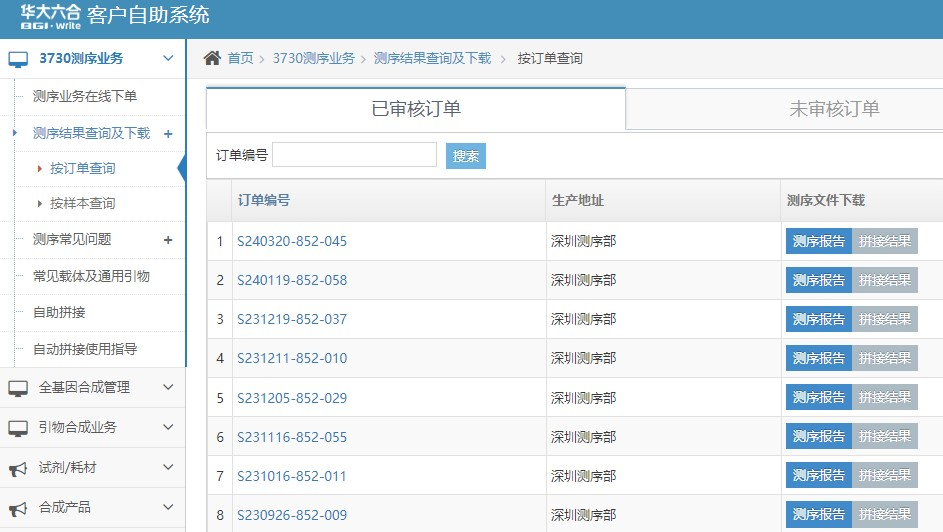
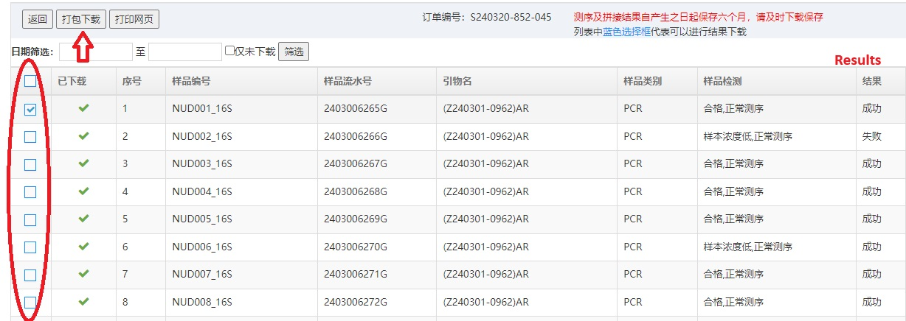
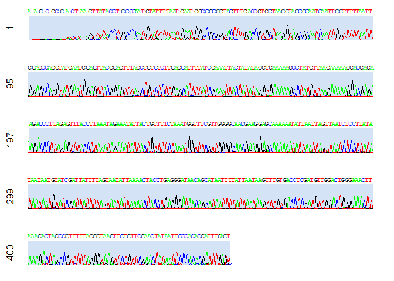

Module 1 - Retrieving and organizing files
================

## 1. Retrieving files from BGI

Log in the **BGI portal**
(<https://customer.genomics.cn/customer-self/login#/homepage>) with the
lab account and password. After logging in, click the part in red circle
in the left column as shown in the screenshot below:


<br> Then choose the folder of your Sanger sequencing job here. <br>
<br>

<br> Samples submitted in the job are listed here. Check the boxes on
the left column for the samples you wish to download. File download
could take a bit of time for a large batch of samples. The sequencing
results come as a `.zip` folder in your designated directory. Note that
the data is available for download within 6 months after release, timely
retreival of data is suggested to avoid data loss. <br> <br>

<br>

## 2. Set working directory in R

After unzipping the folder, we can start the workflow in the `R`
environment. Set the working directory as the directory where the files
locate. Then inspect the structure of the folder.

``` r
setwd("D:/MSL Projects/ECF Seaslug/BGI_Batch1_20240326/")
list.dirs(path = getwd(), recursive = FALSE)
```

    ## [1] "D:/MSL Projects/ECF Seaslug/BGI_Batch1_20240326/Fail"   
    ## [2] "D:/MSL Projects/ECF Seaslug/BGI_Batch1_20240326/Rename" 
    ## [3] "D:/MSL Projects/ECF Seaslug/BGI_Batch1_20240326/Success"

There are 2 main folders in the directory: `Fail` and `Success`. There
will be no `Fail` folder if all your samples are successfully sequenced.
We will focus on the `Success` folder for subsequent analysis.

Now we can change the directory to be the `Success` folder and examine
its structure.

``` r
setwd("D:/MSL Projects/ECF Seaslug/BGI_Batch1_20240326/Success")
list.dirs(path = getwd(), recursive = FALSE)
```

    ## [1] "D:/MSL Projects/ECF Seaslug/BGI_Batch1_20240326/Success/Double peaks"
    ## [2] "D:/MSL Projects/ECF Seaslug/BGI_Batch1_20240326/Success/Structure"

Within the `Success` folder, there are 2 more sub-folders named
`Double peaks` and `Structure`. Samples within these 2 folders may not
be clean enough for subsequent base-calling from the chromatograms. We
will leave these sequences for manual check-up later. Again, these 2
folders may not appear in your folder if all of your samples are
well-sequenced!

For more information the interpretation of sequencing chromatograms, you
can check these useful links below: <br> 1. [DNA Sequencing Core
Facility - University of North
Texas](https://biology.unt.edu/~jajohnson/Chromatogram_Interpretation)
<br> 2. [Center for Computational and Integrative Biology - Harvard
Medical
School](https://dnacore.mgh.harvard.edu/new-cgi-bin/site/pages/sequencing_pages/seq_troubleshooting.jsp)

Now focus on the non-problematic samples.

    ## [1] "example_trim_df.Rdata" "Module1.md"            "Module1.Rmd"          
    ## [4] "Module2.md"            "Module2.Rmd"           "README.md"

There are 2 types of files for each sample: **`.ab1`** and **`.seq`**.
<br> **`.ab1`** contains the chromatogram and **`.seq`** contains the
sequence.

## 3. Renaming files

You may notice in the above part that the file names are quite long,
which consists of several parts separated by double underscores `__`.

For example, file `NUD001_COI__(Z240301-0963)H2198__A06_2403006641G.ab1`
has 3 parts in its name: `NUD001_COI`, `(Z240301-0963)H2198` and
`A06_2403006641G`.

The first part `NUD001_COI` corresponds to the sample name you provided
in the order form. The second part after the the parenthesis `H2198` is
the name of the primer in the order form. Other parts should be the
identifiers of well position and job ID, which we may not be interested
in.

You may simplify the file names with the function `rename_files()`.
There are 4 arguments in the function: input directory (`input_dir`),
output directory (`out_dir`), whether to include primer name
(`incl_primer`; default = TRUE). and whether to output a file containing
the file names before and after renaming (`output_tbl`; default =
FALSE). Below shows an example to run the function.

First, we can first load the packages required in the subsequent steps.

Then call the function.

``` r
source("0_rename_files.R")
rename_files(input_dir = "D:/MSL Projects/ECF Seaslug/BGI_Batch1_20240326/Success",
             output_dir = "D:/MSL Projects/ECF Seaslug/BGI_Batch1_20240326/Rename",
             incl_primer = FALSE,
             output_tbl = TRUE)
```

## 4. Assigning genes to different folder

Since the folder may contain results from several genes/primer sets, you
may wish to separate the files into different sub-folders. You can edit
the index table generated by the `rename_files()` function with
`output_tbl = TRUE` manually by adding a column `new_folder`, and plug
the table into the function `file_move`.

``` r
source("1_new_folder.R")
file_move("D:/MSL Projects/ECF Seaslug/BGI_Batch1_20240326/Rename2/BGI_file_rename.tsv")
```

## 5. Visualizing chromatograms

Now we have placed the files in our designated folders, and we can take
a look at the chromatograms of our sequences. First, we can install the
with the package
[`sangerseqR`](https://bioconductor.org/packages/release/bioc/html/sangerseqR.html),

``` r
BiocManager::install("sangerseqR")
```

then read the `.ab1` file into a `sangerseq` class object.

``` r
file_abi <- list.files(dir, full.names = TRUE) %>% .[which(str_detect(., "ab1"))] %>% .[1]
chrom <- readsangerseq(file_abi); print(chrom)
```

    ## Number of datapoints: 5762
    ## Number of basecalls: 459
    ## 
    ## Primary Basecalls: AAGCGCGACTAAGTTATACCTGCCCAATGTATTTTAATGAATGGCCGCGGTACTTTGACCGTGCTAAGGTAGCGCAATCAATTGGTTTTTAATTGGAGCCAGGTATGAATGGAGTTACGGAGTTTAGCTGTCTCTTGAGCATTTTATCGAAATTACTATATAGGTGAAAAAGCCTATGTTAAGAAAAAGGACGAGAAGACCCTTAGAGTTTACCTTAAATAGAAATATTACTGTTTTCTAAATGGTTTCGTTGGGGCAACGAAGGAGCAAAAAATATTAATTAGTTAATCTCCTTATATAATAATGTATCGATTATTTTAGTAATATTAAAACTACCTGAGGGATAACAGCATAATTTTATTAATAAGTTTGTGACCTCGATGTTGGACTGGGAAACTTAAAGACTAGCCGTTTTTAGGGTAAGTTCTGTTCGAACTATAATTCCCACACGATTTGAGT
    ## 
    ## Secondary Basecalls:

then we can visualize the chromatogram with the function
`chromatogram()`.

``` r
chromatogram(chrom, width = 100, height = 2, showcalls = "primary")
```

<!-- -->
