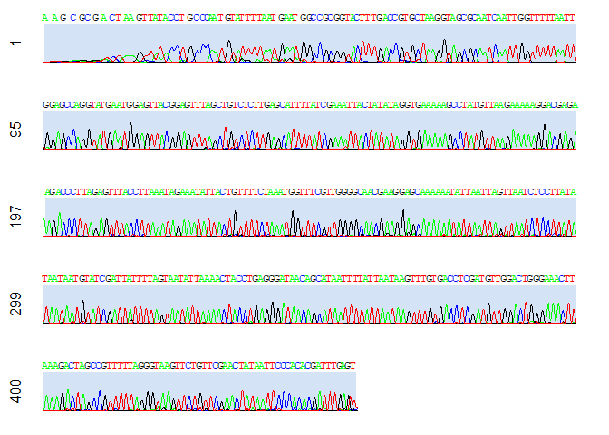
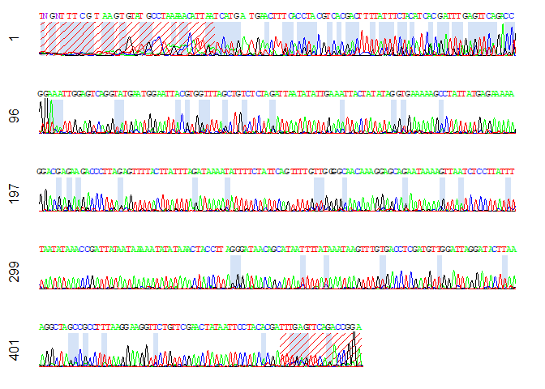

Module 2 - Trimming bases of low quality from 5’ and 3’ ends
================

First, we can first load the packages required in the subsequent steps.

``` r
library(tidyverse) # also in Module 1
library(data.table) # also in Module 1
library(sangerseqR) # also in Module 1
library(Biostrings)
```

## 1. Trimming 5’ and 3’ ends of sequences

``` r
chromatogram(chrom, width = 100, height = 2, showcalls = "primary")
```

<!-- -->

From the above chromatogram, you may notice that there are bases of
lower quality which you may need to trim away. The function
`gen_trim_tbl()` takes a few arguments to determine which position to
trim: (i) `basecall_ratio`: cutoff ratio for separating signal and noise
in the `makeBaseCalls()` function in package `sangerseqR`, in which the
ratio is relative to maximum peak in basecall window. The default value
is set at 0.33 as in the original function.

2)  `trimmable_5`: the maximum number of base allowed to be trimmed from
    5’ end with respect to sequence length, default = 0.1, i.e. if
    sequence length = 400, the maximum number of bases to be trimmed
    from 5’ end = 40.

3)  `trimmable_3`: the maximum number of base allowed to be trimmed from
    3’ end with respect to sequence length, default = 0.05.

4)  `low_peak_pct`: the default value is 0.1 which corresponds to the
    10th percentile of the maximum peak amplitudes for each basecall
    window, positions at which the amplitude of peak is lower than that
    value is considered to be of lower quality.

5)  `output_chrom_name`: it is the name of file to save to if you opt to
    output the chromatogram as PDF. Default is set to `NULL` so that no
    chromatograms will be generated.

The following is an example showing the output data frame with the
suggested number of bases to be trimmed from 5’ and 3’ ends (`trim5` and
`trim3`).

``` r
source("3_trim_ab1.R")
gen_trim_tbl("NUD006_16S.ab1")
```

| file                                                                      | trim5 | trim3 | basecall_ratio | low_peak_pct | trimmable_5 | trimmable_3 |    score | trimmable_5_pos | trimmable_3_pos | mismatch_pos      | low_peak_pos                                                                                                                                                  |
|:--------------------------------------------------------------------------|------:|------:|---------------:|-------------:|------------:|------------:|---------:|----------------:|----------------:|:------------------|:--------------------------------------------------------------------------------------------------------------------------------------------------------------|
| D:/MSL Projects/ECF Seaslug/BGI_Batch1_20240326/Rename/16S/NUD006_16S.ab1 |    33 |    17 |           0.33 |          0.1 |         0.1 |        0.05 | 858.2924 |              46 |             446 | 1;2;4;5;11;91;462 | 1;2;3;4;5;6;7;8;9;10;11;12;13;14;17;33;99;100;104;107;109;112;128;135;139;145;173;214;230;251;256;262;275;280;284;287;340;350;354;368;391;407;424;429;448;462 |

If you opt to output a chromatogram, this would be how it looks. Regions
crossed in red would be trimmed. You can evaluate if the trimming
regions are reasonable and make changes if necessary.
<!-- -->

For a batch of samples, you can use `map()` function and a data frame
will be generated.

``` r
source("3_trim_ab1.R")
trim_df <- map(file_names, gen_trim_tbl) %>% rbindlist()
```

| file                                                                      | trim5 | trim3 | basecall_ratio | low_peak_pct | trimmable_5 | trimmable_3 |    score | trimmable_5_pos | trimmable_3_pos | mismatch_pos         | low_peak_pos                                                                                                                                                     |
|:--------------------------------------------------------------------------|------:|------:|---------------:|-------------:|------------:|------------:|---------:|----------------:|----------------:|:---------------------|:-----------------------------------------------------------------------------------------------------------------------------------------------------------------|
| D:/MSL Projects/ECF Seaslug/BGI_Batch1_20240326/Rename/16S/NUD003_16S.ab1 |    27 |     0 |           0.33 |          0.1 |         0.1 |        0.05 | 862.3376 |              45 |             437 | 2;4;6;8;14;27        | 1;2;3;4;5;6;7;8;9;10;11;12;13;14;16;18;27;30;45;51;70;72;96;102;104;127;163;165;206;218;234;246;250;251;284;321;322;351;373;380;392;408;412;418;421;433          |
| D:/MSL Projects/ECF Seaslug/BGI_Batch1_20240326/Rename/16S/NUD004_16S.ab1 |    18 |    15 |           0.33 |          0.1 |         0.1 |        0.05 | 862.3837 |              46 |             440 | 1;5;10;13;18;452;454 | 1;2;3;4;5;6;7;8;10;11;12;13;15;18;37;49;55;76;96;108;167;169;210;213;222;240;249;251;252;256;257;263;292;315;335;345;367;374;399;402;413;415;427;454;455;456;457 |
| D:/MSL Projects/ECF Seaslug/BGI_Batch1_20240326/Rename/16S/NUD005_16S.ab1 |    18 |    13 |           0.33 |          0.1 |         0.1 |        0.05 | 874.2281 |              46 |             442 | 1;4;5;7;18;454       | 1;2;3;4;5;6;7;8;9;11;12;13;14;16;18;30;39;51;57;68;110;167;169;171;212;242;251;253;254;258;259;265;294;317;337;347;369;376;401;404;415;417;429;456;457;458;459   |
| D:/MSL Projects/ECF Seaslug/BGI_Batch1_20240326/Rename/16S/NUD006_16S.ab1 |    33 |    17 |           0.33 |          0.1 |         0.1 |        0.05 | 858.2924 |              46 |             446 | 1;2;4;5;11;91;462    | 1;2;3;4;5;6;7;8;9;10;11;12;13;14;17;33;99;100;104;107;109;112;128;135;139;145;173;214;230;251;256;262;275;280;284;287;340;350;354;368;391;407;424;429;448;462    |
| D:/MSL Projects/ECF Seaslug/BGI_Batch1_20240326/Rename/16S/NUD007_16S.ab1 |    18 |    15 |           0.33 |          0.1 |         0.1 |        0.05 | 844.4559 |              44 |             424 | 1;2;3;4;12           | 1;2;3;4;5;6;7;8;9;10;11;12;14;15;16;18;48;59;69;83;93;99;124;160;162;170;203;215;237;238;243;249;256;278;302;318;328;350;369;385;396;402;438;439;440             |
| D:/MSL Projects/ECF Seaslug/BGI_Batch1_20240326/Rename/16S/NUD008_16S.ab1 |    14 |    23 |           0.33 |          0.1 |         0.1 |        0.05 | 864.2735 |              45 |             434 | 6;12;14;453;456      | 1;2;3;4;5;6;7;8;9;10;11;12;14;17;47;53;64;72;74;79;88;104;126;130;166;168;183;209;221;267;269;276;322;336;346;356;368;375;387;400;403;407;428;454;455;456        |

## 2. Output .fasta file of trimmed sequences

After finalizing the number of bases to be trimmed at both 5’ and 3’
ends and updating the table from the above step (if necessary), we can
now export a `.fasta` file containing the trimmed sequences with the
function `export_fa_fm_tbl()`. This function read a table as shown in
the example above, with column names `file` which contains the file path
of the `.ab1` files, `trim5` and `trim3` containing the number of bases
to be trimmed from the 5’ and 3’ ends respectively.

``` r
source("4_export_trim_fasta.R")
export_fa_fm_tbl(trim_df, "trimmed_seq.fasta")
```

    ## DNAStringSet object of length 10:
    ##      width seq                                              names               
    ##  [1]   432 TGTATTTTAATGAATGGCCGCGG...ATAATTCCCACACGATTTGAGT NUD003_16S
    ##  [2]   430 CCTGCCCAGTGTAGTTTAGTGTA...GAACTATAATTCCCACACGATT NUD004_16S
    ##  [3]   434 AACCTGCCCAGTGTAGTTTAGTG...ACTATAATTCCCACACGATTTG NUD005_16S
    ##  [4]   418 TCATGATGAACTTTCACCTACGT...TCGAACTATAATTCCTACACGA NUD006_16S
    ##  [5]   413 CCTGCCCAATGTTATATTAATGG...GAACTCTAATTCCTACACGATT NUD007_16S
    ##  [6]   419 TGTACCTGCCCAATGTGTAAAAC...AAGGAAAGTTCTGTTCGAACTA NUD008_16S
    ##  [7]   422 TATACCTGCCCAATGTGCAACAA...AGGGAAGTTCTGTTCGAACTAT NUD009_16S
    ##  [8]   395 CGCGGTACCCTGACCGTGCTAAG...TTAACTCCTACACGATTTGATT NUD010_16S
    ##  [9]   439 CCTGCTCATGTATAAATTTTCAA...GAACTATTAATCCTACACGATT NUD011_16S
    ## [10]   410 TTTCCGAATGAATGGCCGCGGTA...AACTATTATTCCTACACGATTT NUD012_16S
